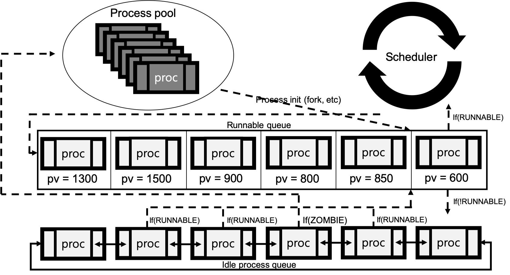
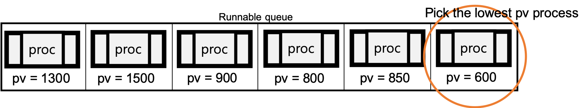
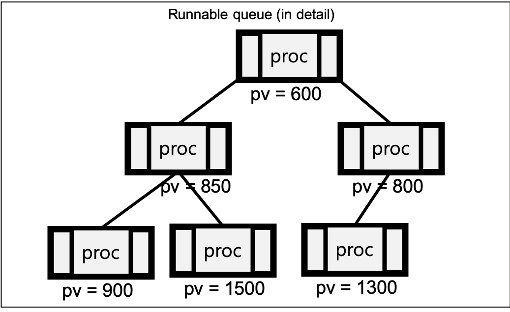
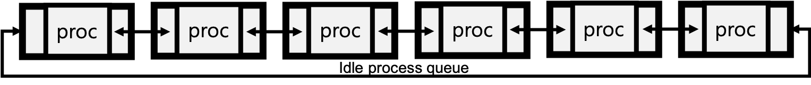

# Stride scheduler in xv6

### **Design** (How it works?)
In scheduling, I think the most important function is process pick. <br>
Every tick, the scheduler picks the process. <br>
Meanwhile, the insertion and deleteion is not that important than picking <br>
So, "O(1) pick" is my first object in this code.<br>

For this, we should make process queue as priority queue.<br>
And there can be NOT RUNNABLE process which has higher priority.<br>
To solve this problem, I also made idle process queue.<br>
In this queue there is no priority, and there is no numbering. <br>
Just in and out, whenever they want. So this queue is not actually queue in general.<br>
Idle queue is implemented just with circular linked list.<br>

#### Design overview


There is process queue, which has process NON_USED<br>
And there is runnable queue. In this queue, not all processes are runnable state. <br>
That means some processes are not runnable.<br> 
It can make the scheduler picks process which is not runnable.<br>
If so, the queue returns NULL to scheduler, and insert it to idle queue.<br>

The runnable queue must get the lowest pv process in O(1) time.<br>

So it is implemented with binary mean heap, for picking O(1) time.<br>
At above situation...<br>

 <br>
This picture shows the detail what is happening in runnable queue.
By doing so, we can pick the least pv process in O(1) time.

The idle queue is just circular linked list. <br>


It is just waiting space for process.<br>
If process turns to RUNNABLE state, process goes to runnable_q.<br>
And if the process state is ZOMBIE, which means terminated process, process goes to process pool. <br>

And there is system call `int stride(int)`.<br>
This system call modifies current process' stride info.<br>

-----------

### **Implementation**
First of all, I change the structure named process.
```cpp
struct stride_info {
    int stride;                 // Save the stride.
    int tickets;
    long long pass_value;
};

struct proc {
    //
    /* original codes */
    //

    /* For runnable queue */
    int is_in_runnable_queue;   // This checks the process is in runnable_queue

    /* For waiting queue */     // Waiting queue : Idle queue.
    struct proc * next;         // If this is not NULL, this process is in idle queue.
    struct proc * prev;

    /* For stride scheduling */
    struct stride_info stride_info;
}
```

Then, I add the idle queue.
```cpp
struct waiting_q {
    uint size;
    struct proc *head;
    struct proc *tail;          // For O(1) insertion
}
```

After that, I add the methods.
```cpp
struct proc *remove_min();                                              // Picking the least pv process
void update_pass_value(struct proc *proc);
void update_min_pass_value();
void assign_min_pass_value(struct proc *proc);                          // For assigning minimum pass value in queue.
void assign_tickets(int tickets);                                       // Used by `stride` system call.
void initialize_stride_info(struct proc *proc);

/* For runnable queue */
void heapify(struct proc *queue[], int size, int start_index);          // For deletion
int insert_proc(struct proc *queue[], int size, struct proc *proc);
struct proc *pop(struct proc *queue[], int size);                       // Used by `remove_min()` method.     
int delete_proc(struct proc *queue[], int delete_index, int size);

/* For idle queue */
void insert_waiting_queue(struct waiting_q *q, struct proc *p);         // O(1) insertion for idle queue.
void delete_proc_in_wq(struct waiting_q *q, struct proc *p);            // O(1) deleteion for idle queue.
```

Every methods for data structure acts literally and ordinary. <br>
So, I will explain the detail just remove_min, scheduler(void), fork and wakeup1 method. <br>

##### `struct proc * remove_min()`

```cpp
struct proc *
remove_min()
{
  struct proc *result = pop(ptable.runnable_queue, ptable.queue_size--);

  if (result != NULL && RUNNABLE != result->state) {
    insert_waiting_queue(&ptable.wq, result);
    return NULL;
  }

  if (ptable.queue_size < 0) {
    ptable.queue_size = 0;
  }

  return result;
}
```
The result will be returned. But the result can be non-runnable process. <br>
If the process can not be run, insert it to waiting queue. <br>
The process which is in waiting queue, goes out the queue when it turns to runnable state. <br>

And if pop failed because of empty queue, `ptable.queue_size` can be overflowed. <br>
So, we must check that. And if that situation happened, fix it. <br>

##### `void scheduler(void)`
```cpp
void
scheduler(void)
{
  struct proc *p;
  struct cpu *c = mycpu();
  c->proc = 0;
  
  for(;;){
    // Enable interrupts on this processor.
    sti();

    // Loop over process table looking for process to run.
    acquire(&ptable.lock);

    p = remove_min();
    if (p != NULL) {
      c ->proc = p;
      switchuvm(p);
      p->state = RUNNING;

      swtch(&(c->scheduler), p->context);
      switchkvm();

      update_pass_value(p);
      if (RUNNABLE == p->state)
        ptable.queue_size = insert_proc(ptable.runnable_queue, ptable.queue_size, p);
      update_min_pass_value();
      c->proc = 0;
    }
    release(&ptable.lock);
  }
}
```

In `scheduler(void)`, the point is not that much. <br>
First, picking process which has least pass value by `p = remove_min()`<br>
Second, run that process and updating pass value using `update_pass_value(p)`<br>
And if the process still runnable, insert the process to runnable queue. <br>
Finally, update the least pass value in the runnable queue.<br>

##### `int fork(void)`
```cpp
int
fork(void)
{
    /* codes .. */
  pid = np->pid;

  acquire(&ptable.lock);

  np->state = RUNNABLE;
  assign_min_pass_value(np);
  ptable.queue_size = insert_proc(ptable.runnable_queue, ptable.queue_size, np);

  release(&ptable.lock);
  
  return pid;
}
```

As you think, fork system call does not have many changes.<br>
The change is that getting the min pass value and inserted to runnable queue for executing immediately. <br>

Actually every state `RUNNABLE` assigns, getting the least pass value, and then that process inserted into runnable queue. <br>

You can see that changes in belows code.

##### `static void wakeup1(void *chan)
```cpp
static void
wakeup1(void *chan)
{
  struct proc *p;

  for(p = ptable.proc; p < &ptable.proc[NPROC]; p++)
    if(p->state == SLEEPING && p->chan == chan) {
      p->state = RUNNABLE;
      delete_proc_in_wq(&ptable.wq, p);
      assign_min_pass_value(p);
      ptable.queue_size = insert_proc(ptable.runnable_queue, ptable.queue_size, p);
    }
}
```

The change looks just like fork. But the only difference is `delete_proc_in_wq`. <br>
This is because the process is in idle queue, because it is not runnable state before. <br>
The fork system call is handling new process, so it is not in idle queue. <br>
Because of this point, there is the difference.

### Trouble shooting
At the first time, my poor heapify does not change the index at all.<br>
So, if there are a lot of fork, the OS stucks. <br>
But I think that problem is in scheduler. <br>

This poor thought takes me five hours to finish this code. T_T <br>

```cpp
void
heapify(struct proc *queue[], int size, int start_index)
{
    /* codes..! */
    if (i != min) {
      struct proc *tmp = queue[i];
      queue[i] = queue[min];
      queue[min] = tmp;
    } 
    else {          // These three lines
      break;        // does not exist
    }               // at that moment.....
  }
}
```

### code etc.

There are a lot of codes for two queues. <br>
Processes are changes its position a lot of time. <br>
But we cannot check that much. <br>

So there are position check when process insertion and deletion. <br>

##### in runnable queue.
```cpp
int
insert_proc(struct proc *queue[], int size, struct proc *proc) 
{
  if (proc->is_in_runnable_queue) {     // Check its position.
      return size;
  }
  /* Other codes... */
}
```

> In runnable queue, just for insertion. <br>
> Deletion just occurs in `remove_min()` <br>

##### 
```cpp
void
insert_waiting_queue(struct waiting_q *q, struct proc *p)
{
  if (p->NEXT != NULL) {              // Check its position.
    /* If p is already in idle queue. */
    return;
  }
  /* Other codes... */
}
```

```cpp
void
delete_proc_in_wq(struct waiting_q *q, struct proc *p)
{
  if (p->next == NULL) {             // Check its position
    /* If p is already out of idle queue */
    return;
  }
  /* Other codes... */
}
```